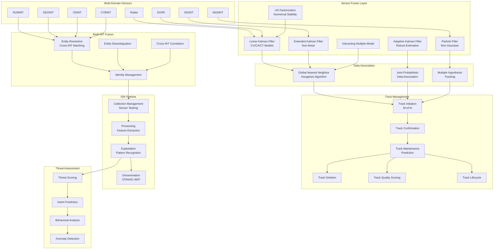
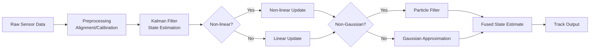
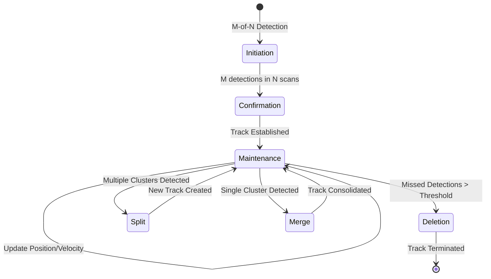
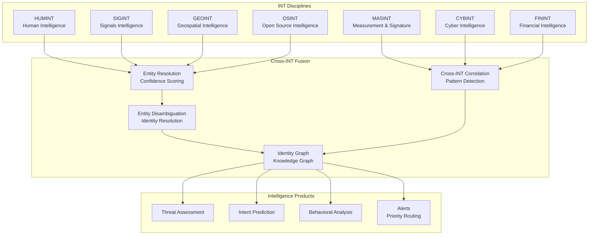

# Apex ISR — Intelligence, Surveillance, Reconnaissance

Sensor fusion, multi-INT fusion, track management with Kalman/EKF filters.

## Architecture

## Sensor Fusion Pipeline

## Track Management Lifecycle

## Multi-INT Fusion Architecture

## Benchmark Comparisons

| Feature | Apex ISR | Palantir Gotham | Anduril Lattice | TAK/ATAK |
|---------|---------|-----------------|-----------------|----------|
| Sensor Fusion | Kalman/EKF/IMM/Particle | Proprietary | Proprietary | Basic |
| Data Association | GNN/JPDA/MHT | ❌ | ❌ | ❌ |
| Track Management | M-of-N lifecycle | ✅ | ✅ | ✅ |
| Multi-INT Fusion | 7 INT disciplines | ✅ | ❌ | ❌ |
| NATO STANAG | 4607 | ❌ | ❌ | ✅ |
| Open Source | AGPL-3.0 | ❌ | ❌ | ❌ |
| Real-time Processing | ✅ | ✅ | ✅ | ✅ |
| Entity Resolution | Cross-INT confidence scoring | ✅ | ❌ | ❌ |

## Tests

~646 tests, TDD-enforced.

## License

AGPL-3.0
