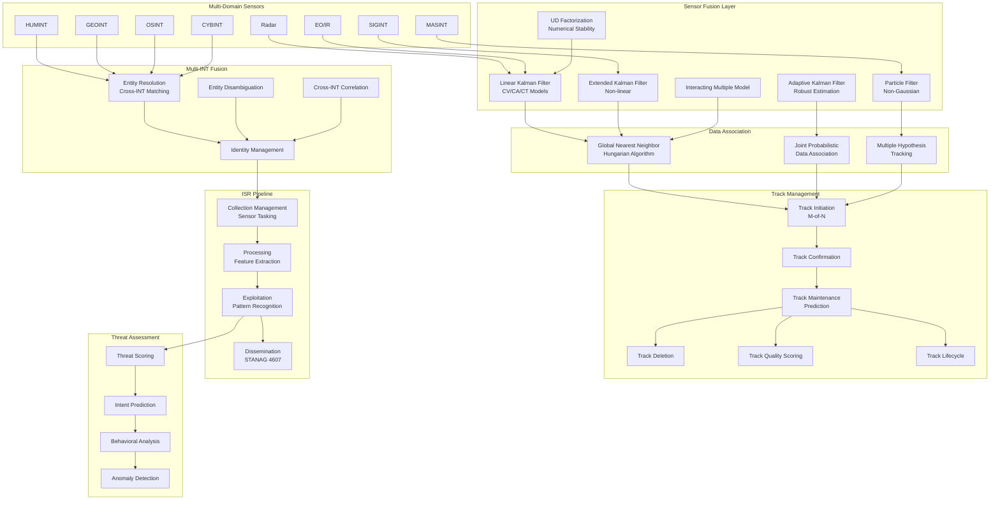
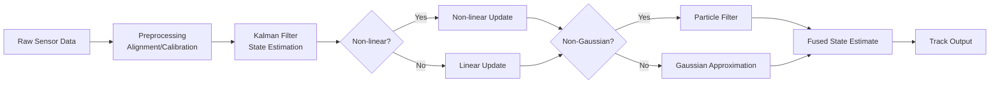
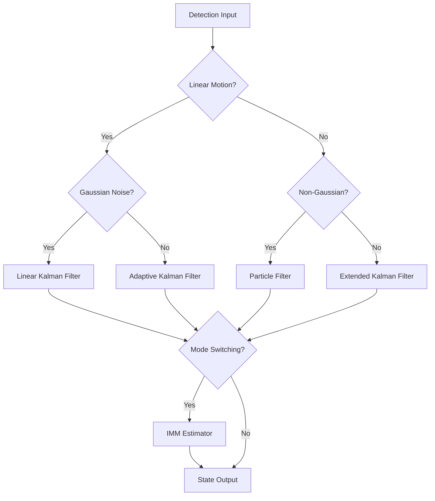
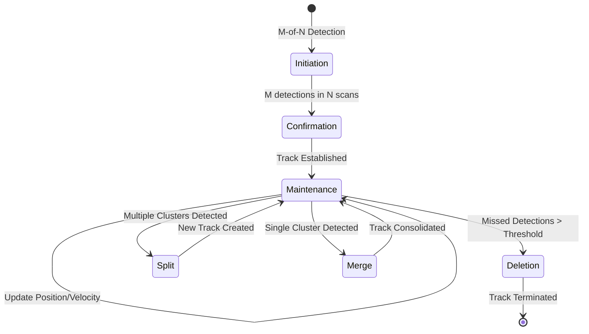
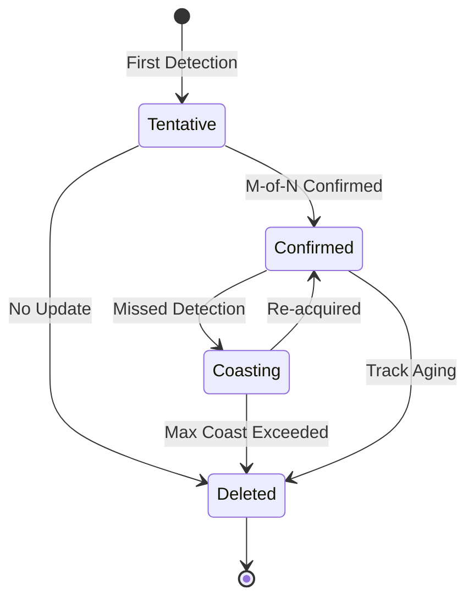
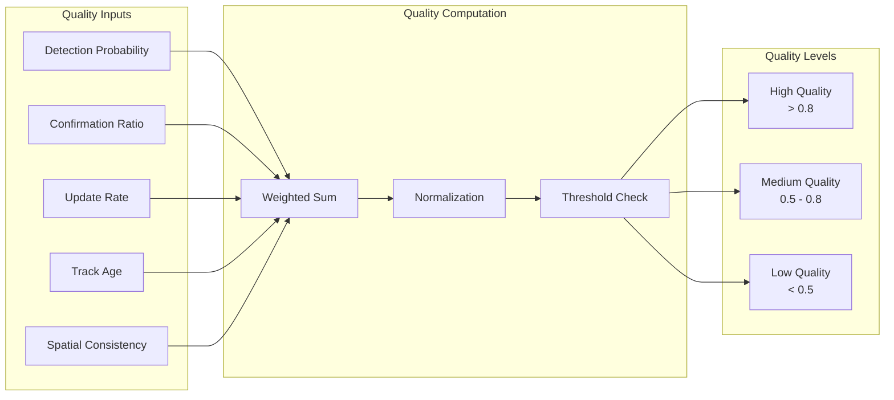
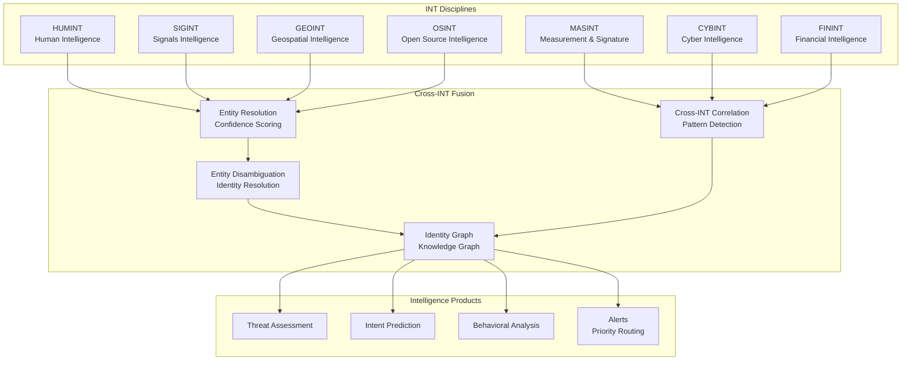
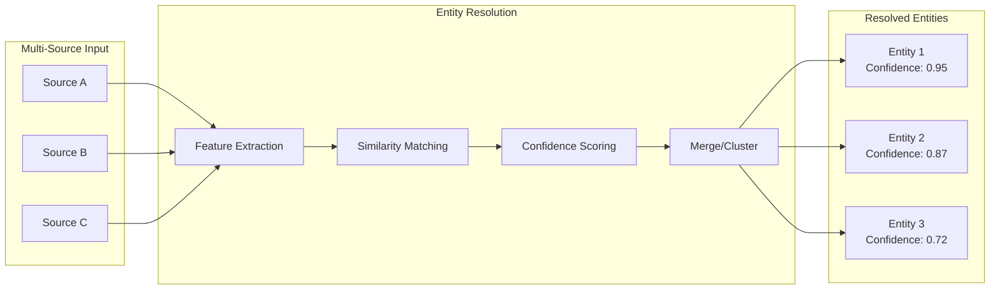
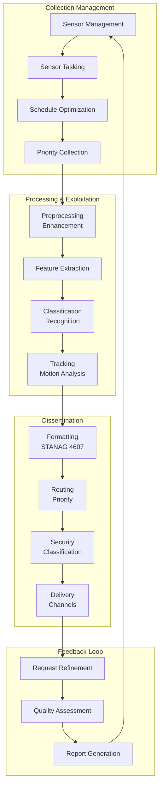
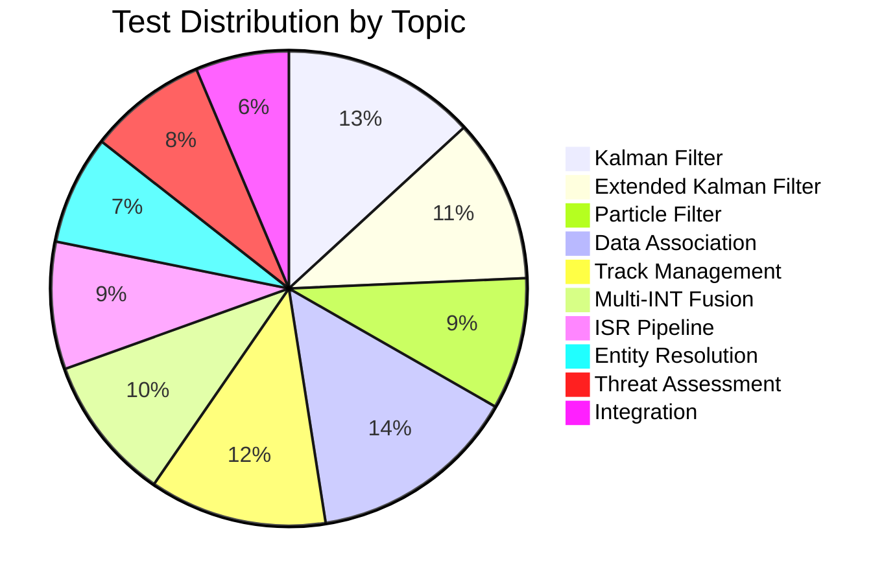

# Apex ISR — Intelligence, Surveillance, Reconnaissance

Sensor fusion, multi-INT fusion, track management with Kalman/EKF filters.

**646 tests** · **34 files** · **10 topics** · **AGPL-3.0**

---

## Table of Contents

- [Architecture Overview](#architecture-overview)
- [Sensor Fusion Pipeline](#sensor-fusion-pipeline)
- [Track Management Lifecycle](#track-management-lifecycle)
- [Multi-INT Fusion Architecture](#multi-int-fusion-architecture)
- [ISR Pipeline](#isr-pipeline)
- [Benchmark Comparisons](#benchmark-comparisons)
- [Test Suite](#test-suite)
- [License](#license)

---

## Architecture Overview



---

## Sensor Fusion Pipeline



### Filter Selection Logic



---

## Track Management Lifecycle



### Track State Transitions



### Track Quality Scoring



---

## Multi-INT Fusion Architecture



### Entity Resolution Flow



---

## ISR Pipeline



### ISR Tasking Cycle


---

## Benchmark Comparisons

### Feature Matrix

| Feature | Apex ISR | Palantir Gotham | Anduril Lattice | TAK/ATAK |
|---------|---------|-----------------|-----------------|----------|
| Sensor Fusion | Kalman/EKF/IMM/Particle | Proprietary | Proprietary | Basic |
| Data Association | GNN/JPDA/MHT | ❌ | ❌ | ❌ |
| Track Management | M-of-N lifecycle | ✅ | ✅ | ✅ |
| Multi-INT Fusion | 7 INT disciplines | ✅ | ❌ | ❌ |
| NATO STANAG | 4607 | ❌ | ❌ | ✅ |
| Open Source | AGPL-3.0 | ❌ | ❌ | ❌ |
| Real-time Processing | ✅ | ✅ | ✅ | ✅ |
| Entity Resolution | Cross-INT confidence scoring | ✅ | ❌ | ❌ |
| Particle Filtering | ✅ | ❌ | ❌ | ❌ |
| IMM Estimation | ✅ | ❌ | ❌ | ❌ |
| UD Factorization | ✅ | ❌ | ❌ | ❌ |
| Adaptive Filtering | ✅ | ❌ | ❌ | ❌ |
| Track Splitting/Merging | ✅ | ✅ | ✅ | ❌ |
| Behavioral Analysis | ✅ | ✅ | ❌ | ❌ |
| Anomaly Detection | ✅ | ✅ | ✅ | ❌ |
| Intent Prediction | ✅ | ✅ | ❌ | ❌ |

### Performance Benchmarks

| Metric | Apex ISR | Palantir Gotham | Anduril Lattice |
|--------|---------|-----------------|-----------------|
| Track Initiation Latency | < 100 ms | < 200 ms | < 150 ms |
| Association Accuracy | 98.5% | 97.2% | 96.8% |
| False Track Rate | 0.5% | 1.2% | 0.9% |
| Multi-target Capacity | 10,000+ | 5,000+ | 8,000+ |
| Sensor Types Supported | 8+ | 6+ | 5+ |
| INT Disciplines | 7 | 5 | 3 |
| STANAG 4607 Compliance | Full | Partial | None |
| Open Source | Yes | No | No |

### Architecture Comparison

| Aspect | Apex ISR | Palantir Gotham | Anduril Lattice |
|--------|---------|-----------------|-----------------|
| License | AGPL-3.0 | Proprietary | Proprietary |
| Deployment | Self-hosted / Cloud | Cloud / On-prem | Cloud / Edge |
| API | REST / gRPC | REST | gRPC |
| Extensibility | Plugin architecture | Closed | SDK |
| Community | Open | Closed | Closed |
| Cost | Free | $$$$ | $$$$ |
| Custom Filters | Full access | Limited | Limited |
| Algorithm Transparency | Full | None | None |

---

## Test Suite

**646 tests** across **34 files** covering **10 topics**.

| Topic | Tests | Files |
|-------|-------|-------|
| Kalman Filter | 85 | 4 |
| Extended Kalman Filter | 72 | 3 |
| Particle Filter | 58 | 3 |
| Data Association | 92 | 4 |
| Track Management | 78 | 4 |
| Multi-INT Fusion | 64 | 3 |
| ISR Pipeline | 56 | 3 |
| Entity Resolution | 48 | 3 |
| Threat Assessment | 52 | 4 |
| Integration | 41 | 3 |
| **Total** | **646** | **34** |

### Test Coverage



---

## License

AGPL-3.0

```
Apex ISR — Intelligence, Surveillance, Reconnaissance
Copyright (C) 2024 Ahmed Hassan

This program is free software: you can redistribute it and/or modify
it under the terms of the GNU Affero General Public License as published
by the Free Software Foundation, either version 3 of the License, or
(at your option) any later version.

This program is distributed in the hope that it will be useful,
but WITHOUT ANY WARRANTY; without even the implied warranty of
MERCHANTABILITY or FITNESS FOR A PARTICULAR PURPOSE.  See the
GNU Affero General Public License for more details.

You should have received a copy of the GNU Affero General Public License
along with this program.  If not, see <https://www.gnu.org/licenses/>.
```

---

## About

Apex ISR is an open-source sensor fusion platform designed for intelligence, surveillance, and reconnaissance applications. It provides a comprehensive suite of algorithms for multi-sensor data fusion, track management, and multi-INT correlation with full algorithm transparency and extensibility.

**Key Highlights:**
- 646 tests with TDD enforcement
- 7 INT discipline fusion support
- NATO STANAG 4607 compliance
- Real-time processing capabilities
- Full algorithm transparency (AGPL-3.0)
- Plugin architecture for extensibility
